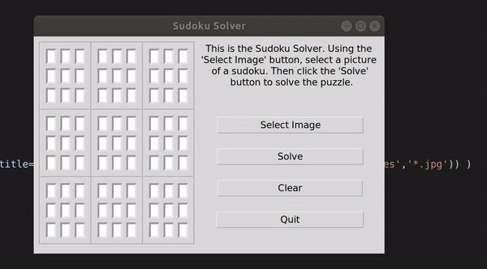

# Sudoku Solver

Given an image of a sudoku grid, it performs following steps:
1. Gaussian Blur to remove noise
2. Canny edge detection using Otsu threshold values
3. Extraction of largest contour
4. Perspective transform (homography) to get top view
5. Adaptive thresholding to get binary image
6. Extraction of each cell of 9x9 grid
7. Using KNN to perform OCR
8. Solving the sudoku using backtracking

### Demo



Note: The images 14,15 work poorly on the Python only versions due to its slow speed and it is not recommended to run those on Python. However, it was resolved by using the C based backend.

## C++
Requirements:
```bash
OpenCV >= 4.2.0
```
### Without GUI
Instruction on how to use:
```bash
make final
./final <path to an image>
```
Note: the GUI version uses GTK+2.0 which is no longer in use

## Python
Requirements:
```bash
pip install opencv-python
pip install tkinter
```
Run ```gui.py``` / ```final.py``` to launch with / without GUI respectively.

## Python with C-based solver
Improved the speed of Python code by integrating C code  
Pre-requisites:
```bash
cc -fPIC -shared -o c_solver.so c_solver.c
pip install opencv-python
pip install tkinter
```
Run ```gui.py``` to launch the application

###  To-do 
1. Use a more sophisticated OCR method
2. Add the functionality of generating a Sudoku
3. Optimise the Sudoku Solver algorithm by trying variants like dancing links
4. Add the option to try out various methods to solve the Sudoku 
   1. Dancing Links
   2. Best First Search
   3. Reverse Backtracking
   4. Spiral Backtracking
